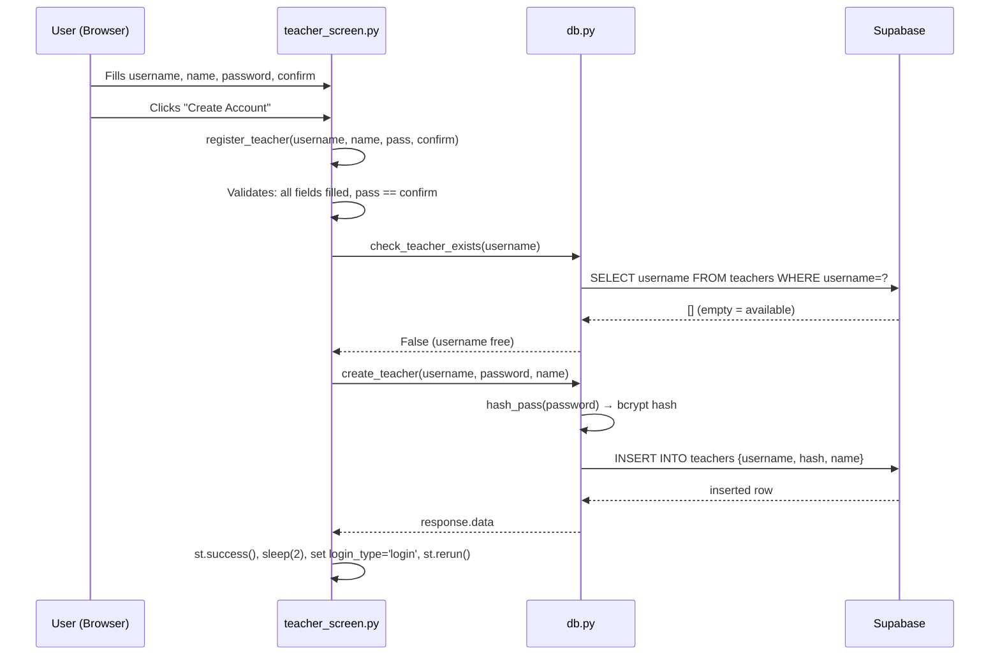
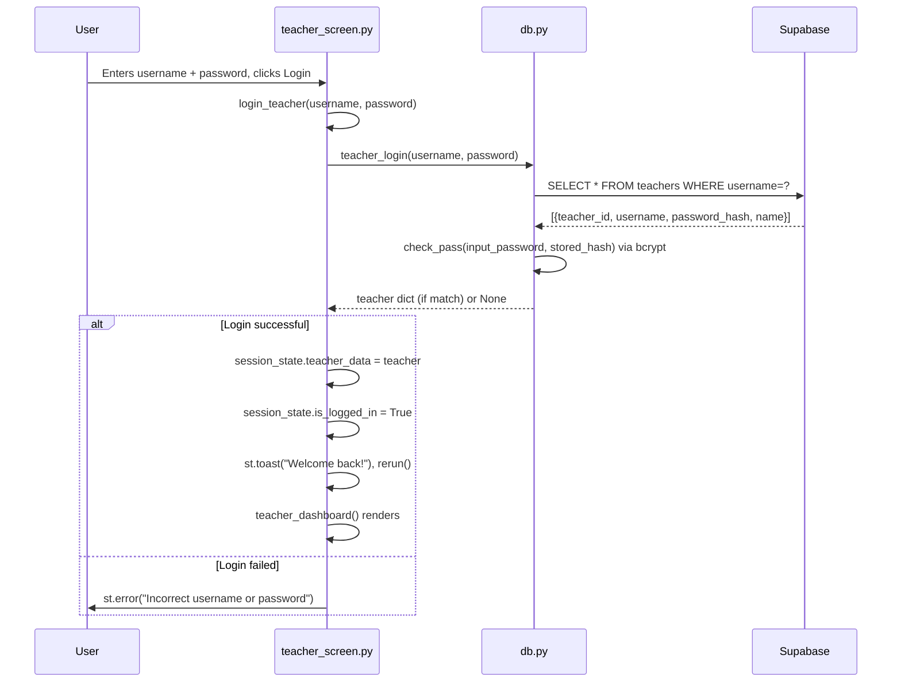
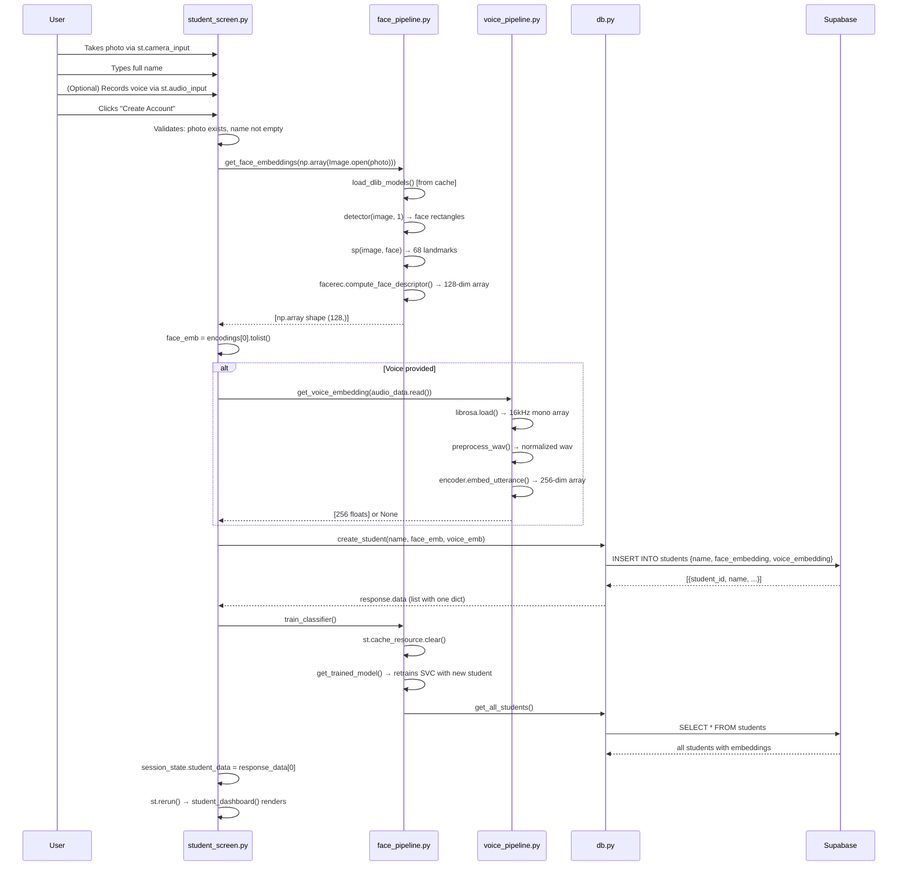
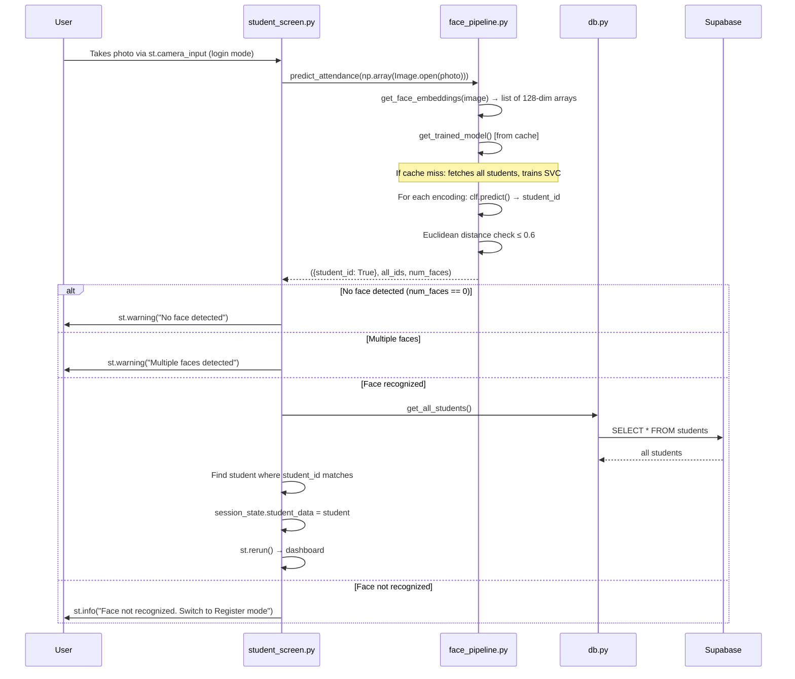
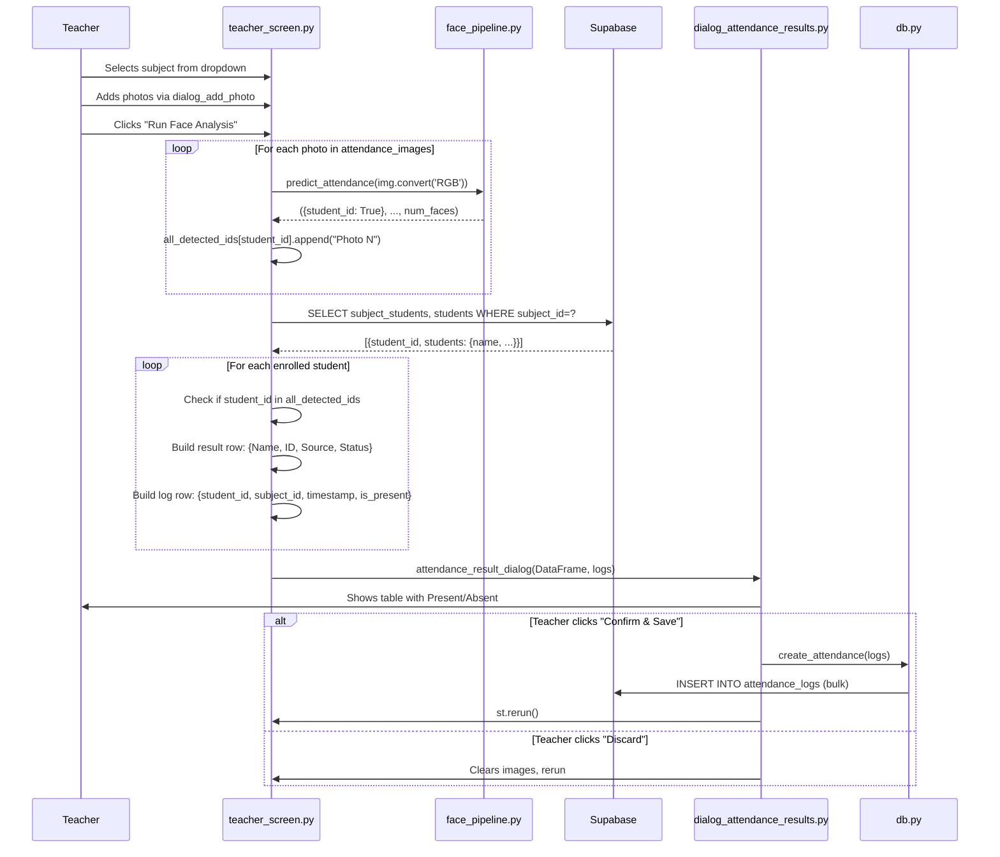
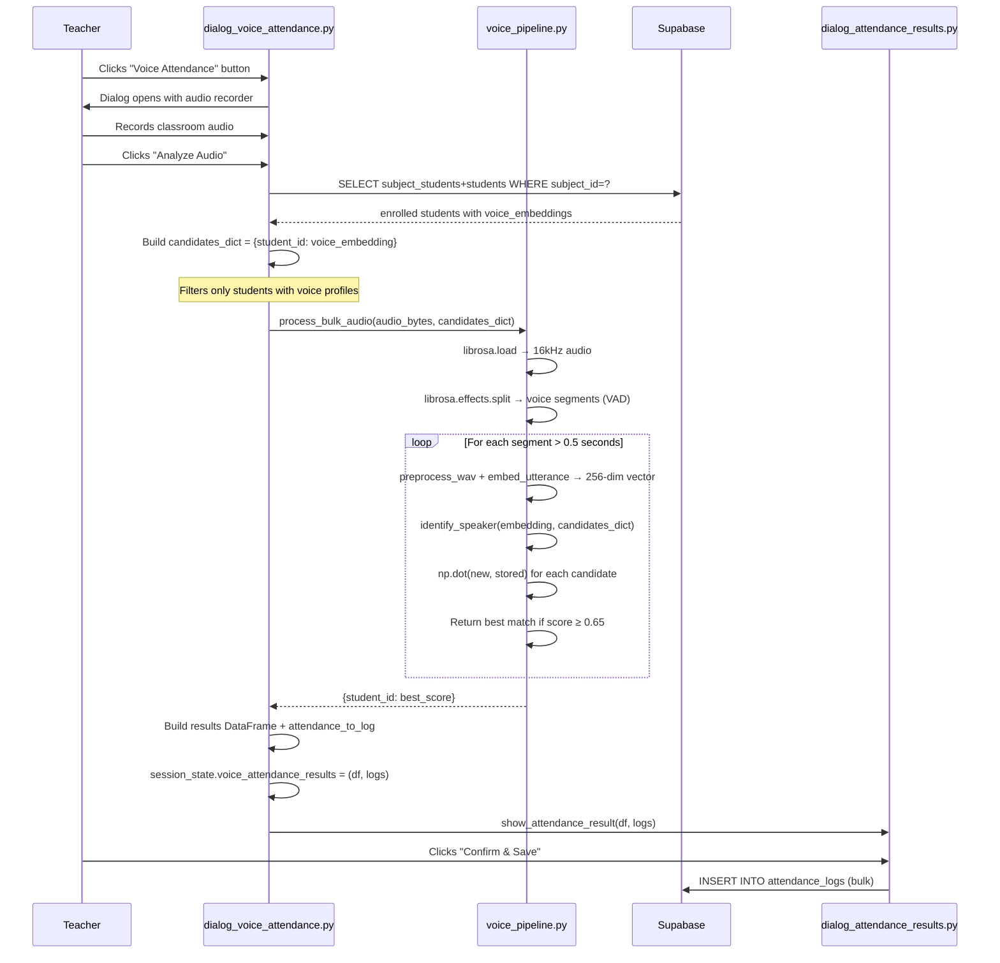
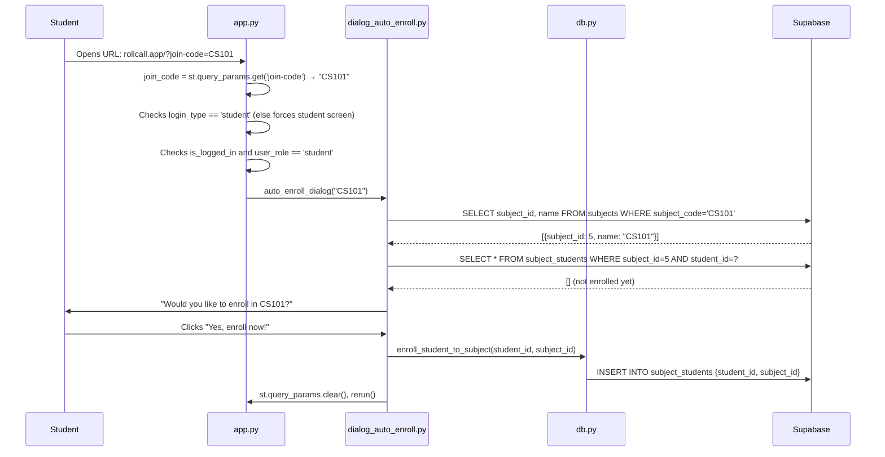
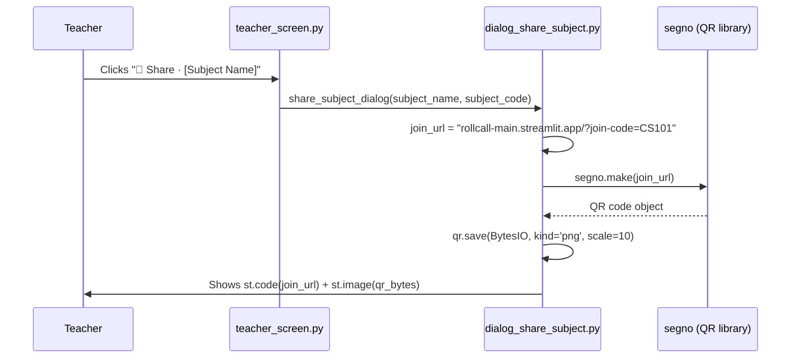

# Complete Execution Flows

Every feature traced from user action → database and back.

---

## Flow 1: Teacher Registration

**Trigger**: User clicks "Create Account" in teacher register form



**Files visited**: `teacher_screen.py` → `db.py` → `database/config.py`  
**Functions**: `teacher_screen_register()` → `register_teacher()` → `check_teacher_exists()` → `create_teacher()` → `hash_pass()`

---

## Flow 2: Teacher Login

**Trigger**: User clicks "Login" in teacher login form



---

## Flow 3: Student Registration (Face + Optional Voice)

**Trigger**: Student in register mode, takes photo, fills name, clicks "Create Account"



---

## Flow 4: Student Face Login

**Trigger**: Student in login mode takes a photo



---

## Flow 5: Teacher Takes Face Attendance

**Trigger**: Teacher adds photos, clicks "Run Face Analysis"



---

## Flow 6: Teacher Takes Voice Attendance

**Trigger**: Teacher clicks "Voice Attendance", records audio, clicks "Analyze Audio"



---

## Flow 7: Student Enrolls in Subject via QR Code

**Trigger**: Student scans QR code → opens app URL with `?join-code=CS101`



---

## Flow 8: Teacher Shares Subject (QR Code Generation)

**Trigger**: Teacher clicks "Share" button on a subject card



Note: No database query in this flow. The QR code is generated purely from the subject_code already in memory.

---

## Password Security Flow

```
Registration:
  raw_password (str)
      → bcrypt.hashpw(pwd.encode(), bcrypt.gensalt())
      → hash stored in Supabase (60-char bcrypt string starting with $2b$)

Login:
  input_password (str) + stored_hash (str from DB)
      → bcrypt.checkpw(input.encode(), hash.encode())
      → bool (True = match)
```

bcrypt is a one-way hash. The original password cannot be recovered. The salt is embedded in the hash string itself, so `gensalt()` is called at registration and does not need to be stored separately.
